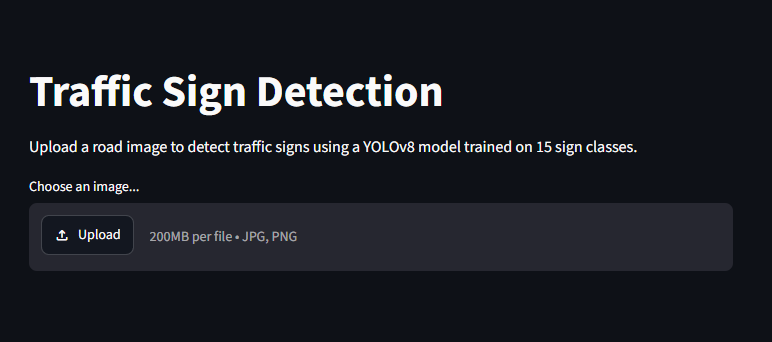
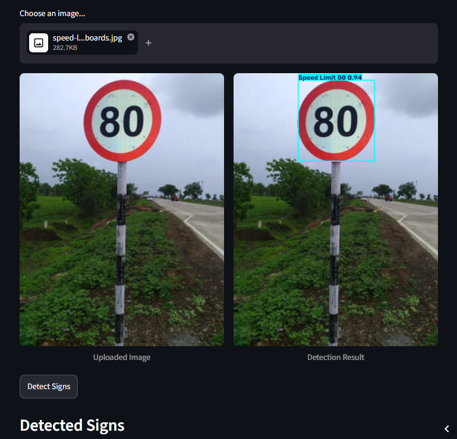
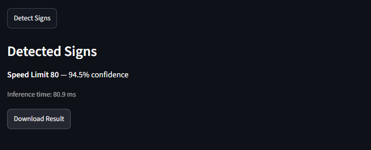
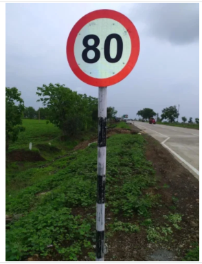
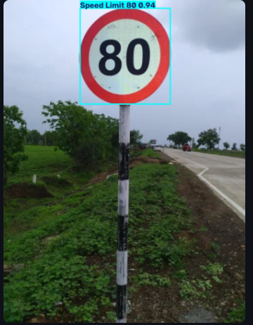

# Traffic Sign Detection using YOLOv8

A 15-class traffic sign detector built with YOLOv8, trained entirely on CPU, wrapped in an interactive Streamlit app. Built as a structured, day-by-day learning project — from an empty folder to a deployed, publicly usable demo.

## Live Demo
Try it here: **[traffic-sign-detection.streamlit.app](https://traffic-sign-detection-x2wnfd6bxwhmgsbfaagigy.streamlit.app/)

## Screenshots





| Upload | Detection Result |
|---|---|
|  |  |

---

## Overview

This project detects and classifies 15 types of traffic signs in road images:

`Green Light` · `Red Light` · `Stop` · `Speed Limit 10/20/30/40/50/60/70/80/90/100/110/120`

Given an image, the model draws a bounding box around each detected sign, labels its class, and reports a confidence score — all through a simple drag-and-drop web interface.

## Key Results

| Metric | Validation | Test (held-out) |
|---|---|---|
| mAP50 | 0.937 | 0.910 |
| mAP50-95 | 0.809 | 0.780 |
| Precision | 0.939 | 0.882 |
| Recall | 0.882 | 0.849 |

Full breakdown — per-class scores, confusion matrix analysis, real-world/out-of-distribution testing, and known limitations — is documented in [`EVALUATION.md`](EVALUATION.md).

## Features

- **Image detection** — upload any road image, get boxes, labels, and confidence scores
- **Video inference** — run detection across an entire video file, frame by frame
- **Live webcam detection** — real-time detection through your webcam
- **Interactive Streamlit app** — no code required to try it, upload and click
- **Downloadable results** — save the annotated detection image

## Tech Stack

- **Model:** YOLOv8n (Ultralytics) — fine-tuned from pretrained COCO weights
- **Training:** PyTorch, CPU-only (no dedicated GPU)
- **Data handling:** OpenCV, NumPy, PyYAML
- **App:** Streamlit
- **Dataset:** [Self-Driving Cars v4](https://universe.roboflow.com/selfdriving-car-qtywx/self-driving-cars-lfjou) via Roboflow (4,969 images, 15 classes)

## Project Structure

```
traffic-sign-detection/
├── app.py                      # Streamlit app
├── requirements.txt
├── EVALUATION.md               # Full model evaluation writeup
├── README.md
├── models/
│   └── best.pt                 # Trained YOLOv8n weights
├── data/
│   └── traffic_sign_dataset/   # Dataset (gitignored — see Setup below)
├── src/
│   ├── check_dataset.py        # Dataset structure verification
│   ├── check_corrupt.py        # Corrupt image detection
│   ├── check_duplicates.py     # Duplicate image detection
│   ├── dedupe_dataset.py       # Removes duplicates / cross-split leakage
│   ├── check_class_balance.py  # Per-class instance counts
│   ├── validate_labels.py      # Label format validator
│   ├── class_coverage.py       # Confirms all classes present per split
│   ├── find_classes.py         # Discovers actual class IDs in use
│   ├── audit_by_class.py       # Visual audit, boxes drawn per class
│   ├── visualize_boxes.py      # Random sample box visualization
│   ├── train.py                # Model training script
│   ├── evaluate.py             # Validation-set evaluation (per-class)
│   ├── evaluate_test.py        # Test-set evaluation (per-class)
│   ├── iou_demo.py             # IoU calculation walkthrough
│   ├── predict_custom.py       # Inference on novel/custom images
│   ├── predict_video.py        # Video file inference
│   └── predict_webcam.py       # Live webcam inference
└── runs/                       # Training/inference outputs (gitignored)
```

## Setup

### 1. Clone the repo
```bash
git clone https://github.com/Twinkle0801/traffic-sign-detection.git
cd traffic-sign-detection
```

### 2. Create a virtual environment
```bash
python -m venv venv
venv\Scripts\activate        # Windows
# source venv/bin/activate   # macOS/Linux
```

### 3. Install dependencies
```bash
pip install -r requirements.txt
```

### 4. Get the dataset (only needed if retraining — not required to run the app)
Download from [Roboflow](https://universe.roboflow.com/selfdriving-car-qtywx/self-driving-cars-lfjou) (YOLOv8 format) and extract into `data/traffic_sign_dataset/`.

## Usage

### Run the app locally
```bash
streamlit run app.py
```
Open `http://localhost:8501`, upload an image, click **Detect Signs**.

### Run inference on your own images
```bash
python src/predict_custom.py
```
(Place images in `data/custom_test/` first.)

### Run inference on a video
```bash
python src/predict_video.py
```

### Run live webcam detection
```bash
python src/predict_webcam.py
```
Press **Q** to stop.

### Retrain the model
```bash
python src/train.py
```

### Evaluate the model
```bash
python src/evaluate.py        # validation set, per-class
python src/evaluate_test.py   # held-out test set, per-class
```

## Model Performance Highlights

- **Strongest classes:** Stop (0.995 AP50), most Speed Limit signs (0.93–0.99 AP50)
- **Weakest classes:** Green Light and Red Light (0.69–0.82 AP50) — traced via confusion matrix to a high background false-positive rate, since traffic lights vary more in scale/angle/lighting than flat standardized signs
- **Known limitation:** vehicle-category speed signs (e.g. signs combining a vehicle icon with the number, common on Indian highways) are not reliably recognized, since the training dataset only contains plain number-only circular signs. A small fine-tuning experiment (documented in `EVALUATION.md`) confirmed this needs more labeled data to fix properly.

See [`EVALUATION.md`](EVALUATION.md) for the complete analysis, including test-set generalization checks, IoU methodology, and real-world/out-of-distribution testing on 14+ genuinely novel images.

## Dataset Notes

- Source: Roboflow "Self-Driving Cars" v4, 4,969 images, 15 classes
- 173 duplicate images (including cross-split leakage between train/valid/test) identified and removed before training
- Original `data.yaml` shipped with an incorrect class count (`nc: 4` instead of the actual 15) — diagnosed and corrected by cross-referencing the source Roboflow project

## License


This project is licensed under the MIT License. See the [LICENSE](LICENSE) file for details.

## Acknowledgments

- Dataset: [Self-Driving Cars v4](https://universe.roboflow.com/selfdriving-car-qtywx/self-driving-cars-lfjou) on Roboflow Universe
- Built with [Ultralytics YOLOv8](https://github.com/ultralytics/ultralytics)